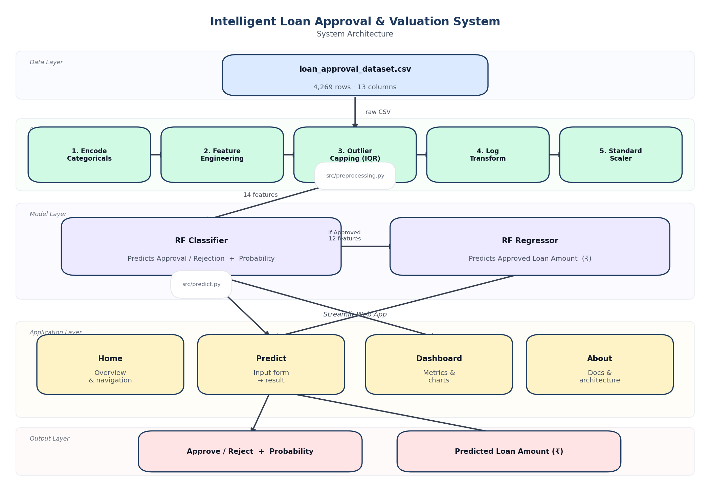

# Intelligent End-to-End Loan Approval & Valuation System


> A production-ready ML pipeline for loan approval prediction and loan amount estimation —
> from raw data exploration through to a deployed Streamlit web application.

---

## System Architecture



---

## Live App

The Streamlit app has three pages:

| Page | Purpose |
|---|---|
| **🔮 Predict** | Enter an applicant's profile and get an instant approval decision + predicted loan amount |
| **📊 Dashboard** | Model performance metrics, feature importance charts, and hyperparameter details |
| **📖 About** | Architecture diagram, data dictionary, pipeline documentation |

---

## Project Structure

```
├── streamlit_app.py               # Home page (Streamlit entry point)
├── pages/
│   ├── 1_Predict.py               # Prediction form
│   ├── 2_Dashboard.py             # Model metrics & feature importance
│   └── 3_About.py                 # Docs, architecture, data dictionary
├── src/
│   ├── config.py                  # Paths, constants, feature lists
│   ├── preprocessing.py           # Encode → engineer → cap → log → scale
│   ├── predict.py                 # Classifier + Regressor inference
│   └── loaders.py                 # Cached artifact loading (st.cache_resource)
├── scripts/
│   ├── train.py                   # Full training pipeline (run once)
│   └── generate_architecture.py   # Generates assets/architecture.png
├── models/                        # Trained artifacts (pkl, joblib, json)
├── assets/
│   └── architecture.png           # Auto-generated system diagram
├── notebooks/
│   ├── EDA.ipynb                  # Automated EDA + HTML report
│   └── modelling.ipynb            # Full modelling pipeline
├── dataset/
│   └── loan_approval_dataset.csv  # Source data (gitignored)
├── .streamlit/
│   └── config.toml                # Theme (navy primary colour)
└── requirements.txt
```

---

## Key Results

### Classifier — Loan Approval

| Metric | Score |
|---|---|
| ROC-AUC | **1.000** |
| F1 Score | **0.999** |
| Accuracy | **0.999** |
| Precision | **0.998** |
| Recall | **1.000** |

> **Key insight:** CIBIL score alone carries a 0.771 Pearson correlation with the target — it acts as a near-perfect separator between approved and rejected applications.

### Regressor — Approved Loan Amount

| Metric | Value |
|---|---|
| R² | see `models/reg_model_metadata.json` |
| MAPE | see Dashboard |

---

## Setup

**Requirements:** Python 3.12, pip

```bash
# 1. Clone the repository
git clone https://github.com/<your-username>/intelligent-loan-approval-system.git
cd intelligent-loan-approval-system

# 2. Create and activate a virtual environment
python -m venv .venv
source .venv/bin/activate        # macOS / Linux
# .venv\Scripts\activate         # Windows

# 3. Install dependencies
pip install -r requirements.txt

# 4. Add the dataset (gitignored)
#    Place loan_approval_dataset.csv in dataset/

# 5. Train the models (writes artifacts to models/)
python scripts/train.py

# 6. Run the Streamlit app
streamlit run streamlit_app.py
```

The app will open at `http://localhost:8501`.

---

## Deploying to Streamlit Community Cloud

1. Push the repository to GitHub (models/ **is** tracked — artifacts must be committed).
2. Go to [share.streamlit.io](https://share.streamlit.io) → **New app**.
3. Select the repository, branch `main`, and set **Main file path** to `streamlit_app.py`.
4. Click **Deploy**.

---

## Preprocessing Pipeline

```
Raw applicant data
  ↓ Step 1 — Encode categoricals   (education, self_employed → 0/1)
  ↓ Step 2 — Feature engineering   (total_assets, loan_to_income, asset_to_loan)
  ↓ Step 3 — Outlier capping       (IQR method, fitted on train set only)
  ↓ Step 4 — Log transform         (log1p on skewed asset columns)
  ↓ Step 5 — StandardScaler        (fitted on train set only)
  ↓
 Model input (14 features for classifier / 12 for regressor)
```

All steps that learn parameters are **fitted on training data only** to prevent data leakage.

---

## Modelling Approach

### Two-stage Hyperparameter Tuning

1. **RandomizedSearchCV** (100 candidates × 5-fold CV) — broad exploration over `n_estimators`, `max_depth`, `min_samples_split`, `min_samples_leaf`, `max_features`, `bootstrap`, `class_weight`
2. **GridSearchCV** — fine-tuned grid centred on Stage 1 winner

### Regressor Design

- Trained **exclusively on approved loans** to avoid corrupted signal from rejected applications.
- `loan_amount`-derived features (`loan_to_income`, `asset_to_loan`) are replaced by `asset_to_income` to prevent target leakage.
- Target is **log-transformed** during training; predictions are inverse-transformed (`expm1`) back to ₹.

---

## Tech Stack

| Category | Library | Purpose |
|---|---|---|
| Web App | `streamlit` | UI framework and multi-page app |
| ML | `scikit-learn` | Preprocessing, Random Forest, hyperparameter search |
| Data | `pandas`, `numpy` | Transformation and feature engineering |
| Visualisation | `plotly` | Interactive charts and gauge indicators |
| Serialisation | `pickle`, `joblib` | Model and scaler persistence |
| Statistics | `scipy` | Distributions for RandomizedSearchCV |
| Diagram | `matplotlib` | Architecture diagram generation |

---

## Roadmap

- [x] Automated EDA with HTML report export
- [x] Feature engineering and preprocessing pipeline
- [x] Multi-model baseline comparison (7 classifiers, 6 regressors)
- [x] Hyperparameter tuning (RandomizedSearchCV → GridSearchCV)
- [x] Cross-validation (StratifiedKFold / KFold, 5 folds)
- [x] Regression model for approved loan amount
- [x] Streamlit web application (Predict, Dashboard, About)
- [x] Modular Python package (`src/`)
- [x] System architecture diagram
- [ ] SHAP explainability for per-prediction feature attribution
- [ ] Batch prediction via CSV upload
- [ ] REST API with FastAPI

---

## License

This project is licensed under the MIT License.
